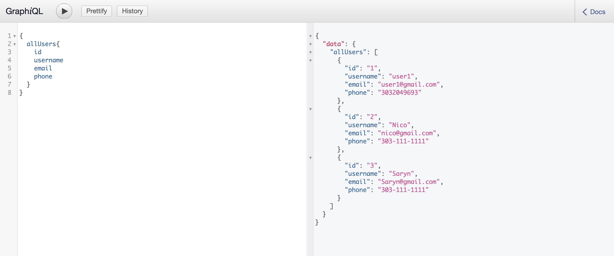
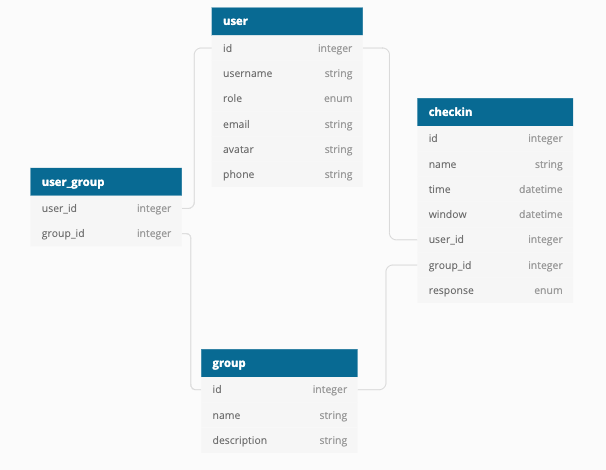
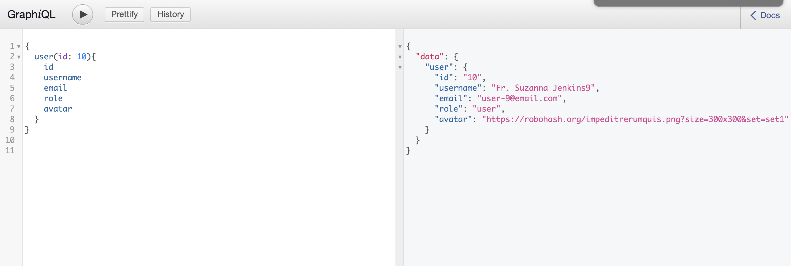
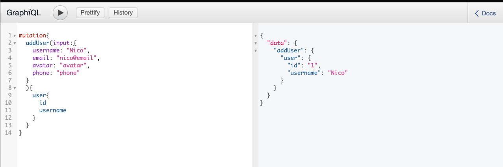

<div align="center">
<p>

# Never Alone Backend Engine

</p>


[](https://github.com/never-alone-turing)
[](https://codeclimate.com/github/nicorithner/never_alone_be/maintainability)
<!--  -->

</div>

### Contributors

- [Saryn Mooney](https://github.com/sarynm12)
- [Daniel Lessenden](https://github.com/D-Lessenden)
- [Nico Rithner](https://github.com/nicorithner)

## Table of Contents

- [Overview](#overview)
- [Specifications](#specifications)
- [Installation](#installation)
- [Testing](#testing)
- [Schema](#schema)
- [Endpoints](#endpoints)
- [Extensions](#extensions)

<hr>

## Overview

This is the backend engine that drives the Never Alone Application. Never Alone is an intuitive application used as an easy and non-intrusive way to check in on friends and family. Simply select a time to set up a check in with a loved one and when the due date for that check in arrives your loved one will simply respond to the request within a timeframe that was agreed upon by everyone involved. The "caretaker" will then receive a notification that everything is fine.

<div align="right"> 

[back to top](#table-of-contents) 

</div>

## Specifications

This project runs on `Rails: 6.0.34` and `Ruby: 2.6.3`<br/>

To check your current versions, run:
```ruby
$ ruby -v
ruby 2.6.3p105 (2018-10-18 revision 65156) [x86_64-darwin19]
$ rails -v
Rails 6.0.3.4
```
<br/>
<hr>

### Gems

Among others, this project uses the following additional gems:<br/>
You can find the most current version at [Rubygems.org](https://rubygems.org/)

- **gem 'graphql', '1.9.18'**

    This gem allowed us to utilize GraphQL for our API endpoints.

- **gem 'graphiql-rails'**

    This gem gives us a visual representation of the endpoint in `localhost:3000` in the browser

<p align="center">
<br/>
<small>sample graphiql</small>
</p>

<div align="right"> 

[back to top](#table-of-contents) 

</div>

## Installation

### Fork and Clone The Repo

Fork this Github repository: [never_alone_be](https://github.com/never-alone-turing/never_alone_be)

Clone your 'never_alone_be' repository using SSH:

``` 
  $ git clone git@github.com:<your-github-username>/never-alone-turing/never_alone_be.git
```

### Initial Installation

In the command line run the following commands in order:

1. `$ rails db:{create,migrate}`
2. `$ bundle install`

<div align="right"> 

[back to top](#table-of-contents) 

</div>

## Testing

### RSpec

<p> We can check the test on the spec folder by running rspec</p>

In the command line run<br/>

`$ bundle exec rspec`

All tests should be passing.

### Simplecov

After running the tests simplecov gathers the coverage and neatly reports them in an html page.

In the command line you should see something like this:<br/>

<div align="right"> 

[back to top](#table-of-contents) 

</div>

## Schema
<br/>

```ruby
Table user {
  id: integer,
  username: string,
  role: enum,
  email: string,
  avatar: string,
  phone: string
}

Table user_group {
  user_id: integer,
  group_id: integer
}

Table group {
  id: integer,
  name: string,
  description: string
}

Table checkin {
  id: integer,
  name: string,
  time: datetime,
  window: datetime,
  user_id: integer,
  group_id: integer,
  response: enum
}
```

<br/>

<p align="center">
<br/>
<small>database schema</small>
</p>

<br/>

## Endpoints

In order for our frontend team to connect to the database we used GraphQL to construct our APIs. The singular endpoint is [https://never-alone-backend.herokuapp.com/graphql](https://never-alone-backend.herokuapp.com/graphql) There are four tables in the database: users, groups, checkins, and a joint-table called user_groups. Each table follows the same pattern of queries and mutations. Below is an example of a query:


``` graphql
 query {
         allUsers{
           id
           username
           role
          }
        }
``` 

<br/>

<p align="center">
<br/>
<small>sample graphiql query</small>
</p>

<br/>

<p align="center">
<br/>
<small>sample graphiql mutation</small>
</p>

<div align="right"> 

[back to top](#table-of-contents) 

</div>

## Extensions

Possible extensions for the future would include:
* Add authentication and authorization
* Edit the checkin name column to require a unique entry.

<div align="right"> 

[back to top](#table-of-contents) 

</div>
